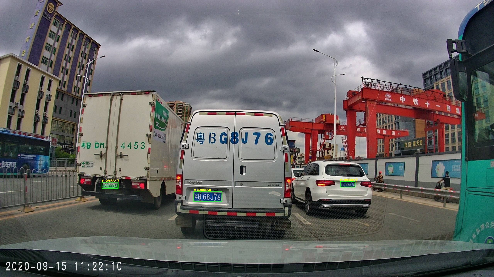
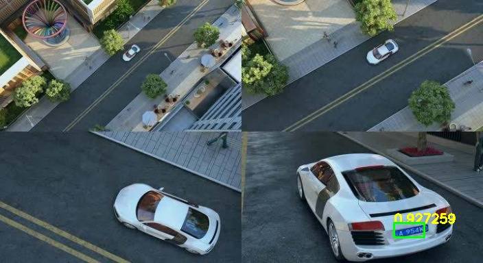

# Amazing_License_Plate_Detector
CPU Real-time Amazing License Plate Detection
# FIND CODE  
https://blog.csdn.net/samylee/article/details/112837675  
# Test steps
Download 'opencv450 dll' and put it to current directory. [BaiDu Cloud](https://pan.baidu.com/s/1X9-pDypbj-TJMFxiSqow9A) Password: 4wpj  
# Algorithm efficiency
`Hardware: CPU(i7-9700K @3.6GHz)`  
| Algorithm | resolution | min_size | Speed/FPS |
|:------:|:------:|:------:|:------:|
| ours  | 320x180 |   36x12 | 526ms/1.9|
| ours  | 640x360 |   36x12 | 14ms/71.4|
| ours  | 640x480 |   36x12 | 14ms/71.4|
| ours  | 1280x720 |  36x12 | 14ms/71.4|
| ours  | 1920x1080 | 36x12 | 14ms/71.4|
# Example result  
  
  
  
  
  
 
 
# Reference
https://blog.csdn.net/samylee
